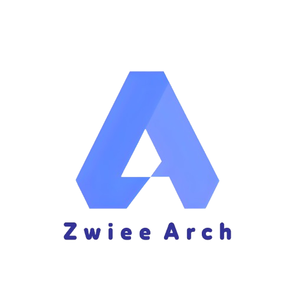

<h1 align="center">
    

        
    

</h1>

    Một 1 distro based từ ArchLinux, gọn nhẹ và "Mỳ ăn liền"! 

 

    <a href="#tinh-nang">Tính năng</a>
    ·
    <a href="#cai-dat">Cài đặt</a>
    ·
    <a href="#yeu-cau-he-thong">Yêu cầu hệ thống</a>
    ·
    <a href="#language">Ngôn ngữ</a>

 

 

## <samp><b>Chào mừng</b></samp>

 

Chào mừng bạn đến với dự án Zwiee Arch!

 

Dự án này cung cấp một hệ thống dựa trên Arch sạch, nhanh và dễ sử dụng. Nó được thiết kế cho những người dùng muốn cài và sử dụng Arch 1 cách đơn giản, đã được pre-install ( Cài đặt sẵn ) 1 vài app cơ bản, và 1 script cài dotfiles đẹp ( Bổ xung dotfiles đẹp tại đây )

 

---

 

<h2 id="tinh-nang"><samp><b>Tính năng</b></samp></h2>

 

    
<samp>Nhấp để xem các tính năng</samp>

     
    <ul>
        <li><b>Dễ dàng cài đặt:</b> Live ISO với xfce4 + <b>Calamares</b>.</li>
        <li><b>Nhẹ & Sạch:</b> Sạch sẽ, không có tính custom riêng ( Kiểu như ủng hộ hay bất cứ gì khác, chỉ có tên OS đổi ( Đây là điều hiển nhiên ) )</li>
        <li><b>Ứng dụng có sẵn:</b> Được cài thêm 1 vài app "Mỳ ăn liền", bao gồm <b>Visual Studio Code</b>, <b>Google Chrome</b>, <b>Java JDK</b>, và <b>Telegram</b>. ( Bổ sung thêm 1 vài phần mềm thiết yêu tại đây )</li>
        <li><b>Cài dotfiles siêu nhanh:</b> Với script hỗ trợ cài VM và DE, cùng 1 vài bộ dotfile siêu đẹp ( Bổ sung thêm dotfiles tại đây )</li>
    </ul>

 

---

 

<h2 id="cai-dat"><samp><b>Cài đặt</b></samp></h2>

 

    
<samp>Nhấp để xem hướng dẫn cài đặt</samp>

     
    
<b>⚠️ LƯU Ý: Hướng dẫn sau đây giả định bạn đang khởi động từ ISO trực tiếp ⚠️</b>

    <ol>
        <li><b>Flash USB ( Hoặc bất cứ thử gì có thể có thể lưu trữ và boot vào đấy được):</b> Có thể sử dụng Rufus ( Chọn DD thay vì recommend ), Balena Etcher, Ventoy.</li>
        <li><b>Boot vào Zwiee_Arch:</b> Tuỳ vào bios ( Có thể là F9, F10, F12,....vv ) để vào boot options, chọn vào ổ đã flash, chọn dòng đầu và nhấn Enter ( Nếu dùng Ventoy thì sau khi boot vào thì chon iso Zwiee_Arch rồi chọn "Boot in normal mode").</li>
        <li><b>Khởi chạy trình cài đặt:</b> Sau khi mở xong, ( tý nữa viết, lười quá :v) <b>Calamares</b> từ menu.</li>
        <li><b>Làm theo hướng dẫn:</b> Trình cài đặt sẽ hướng dẫn bạn qua quá trình phân vùng và cài đặt.</li>
        <li><b>Khởi động lại và tận hưởng:</b> Sau khi cài đặt hoàn tất, hãy khởi động lại máy tính của bạn và đăng nhập vào hệ thống mới.</li>
    </ol>
    
Chúc bạn vui vẻ :smile:

 

---

 

<h2 id="yeu-cau-he-thong"><samp><b>Yêu cầu hệ thống</b></samp></h2>

 

* **Nguồn điện** (tùy chọn) :)))
* **CPU x86_64**
* **RAM 500MB** (tối thiểu, không chạy dotfile)
* **8GB dung lượng ổ đĩa trống**

 

---

 

<h2 id="language"><samp><b>Ngôn ngữ</b></samp></h2>

 

* **English:** You can find the English version of this README [here](/README.md).

 
